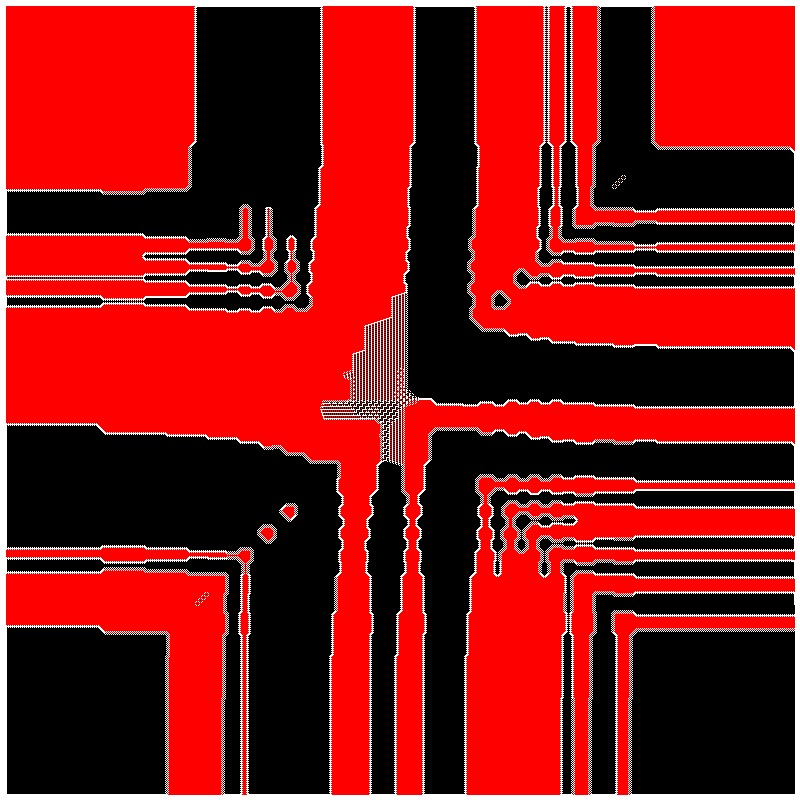

# KnightsOnBoard

SDL3 framebuffer demo that draws a growing pattern on a large canvas.
[Numberphile: Red & Black Knights](https://www.youtube.com/watch?v=UiX4CFIiegM)

## Build it yourself
1. Install SDL3 and `pkg-config`.
2. Open the project folder.
3. Build with `make build` or `make C`.
4. Run with `make run` or `./framebuffer`.
5. Output images are written to `Output/`.

## Images

